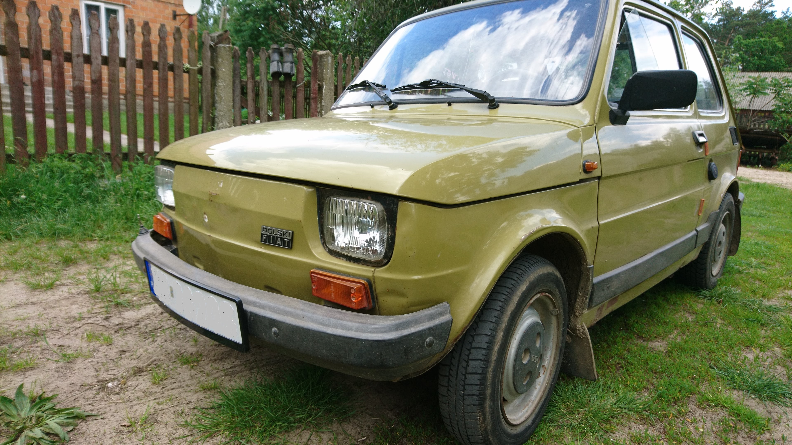

# Fiat 126p

## My first website (link to the page)
https://fiat126p.github.io/homepage/

### Description
The website contains information about the production of the Fiat 126p car, and presents my Fiat 126p.
It is written in the class naming convention "BEM"

#### Section description
The website consists of a navigation section, three sections and a section with contact details.
1. Navigation parts. There are four linked buttons that take us to specific sections of the website. The button names are : "Klika słów o historii Fiata 126p" , "Mój fiat 126p- Kazik", "Ulubione samochody z poprzedniej epoki", "Kontakt".
2. The section "Kilka słów o historii Fiata 126p" tells the story of the Fiat 126 car. There is a link to "https://pl.wikipedia.org/wiki/Fiat_126". In this section there is a photo of the Fiat 126p along with a button that allows you to delete this photo.
3. The section "Mój Fiat 126p- Kazik" shows my Fiat 126p.
4. The section "Ulubione samochodów z poprzedniej epoki" presents a table with my favorite cars from the previous century. There is also a button that changes the section. background. After pressing the button, a dark background appears, when you press the button again, the background returns to its original form.
5. The last section -stop contains two linked buttons. The first with an e-mail address, the second with a telephone number. After pressing them, you are redirected to an e-mail or telephone.
